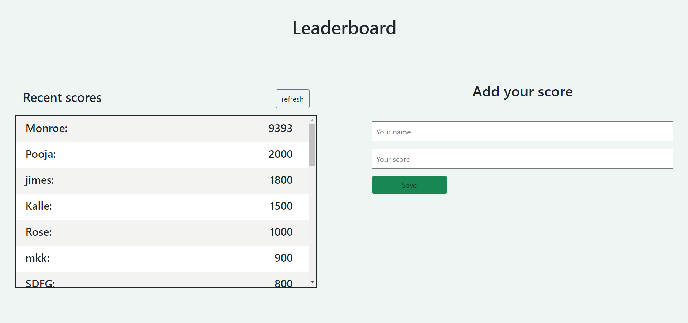

# LeaderBoard

> This is a real time Leaderboard App which manage score and provides the latest data from acsending order. Enjoy Watching!

## Live Demo

- Demo Link: [@leaderboard](https://hector096.github.io/Leaderboard/dist)

##Screenshots

## Built With

- HTML & CSS
- Webpack
- Javascript
- Github

## Getting Started

To get a local copy up and running follow these simple example steps.

### Prerequisites

You have a basic understanding of HTML,CSS,JavaScript, Webpack, Git and Github. 

### Setup

1. Clone the repository with *git clone: [Repository](https://github.com/Hector096/Leaderboard)  
2.  Open your terminal and run `npm install` to install the node packages.
3. Run `npm run start` too run the project.

## Authors

- GitHub: [@githubhandle](https://github.com/Hector096)
- Linkedin: [@linkedinhandle](https://www.linkedin.com/in/vishal-verma-9191b8126/)

## 🤝 Contributing

Contributions, issues, and feature requests are welcome!

Feel free to check the [issues page](https://github.com/Hector096/Leaderboard/issues).

## Show your support

Give a ⭐️ if you like this project!

## Acknowledgments

- Hat tip to anyone whose code was used
- Inspiration
- etc

## 📝 License

This project is [MIT](./MIT.md) licensed.